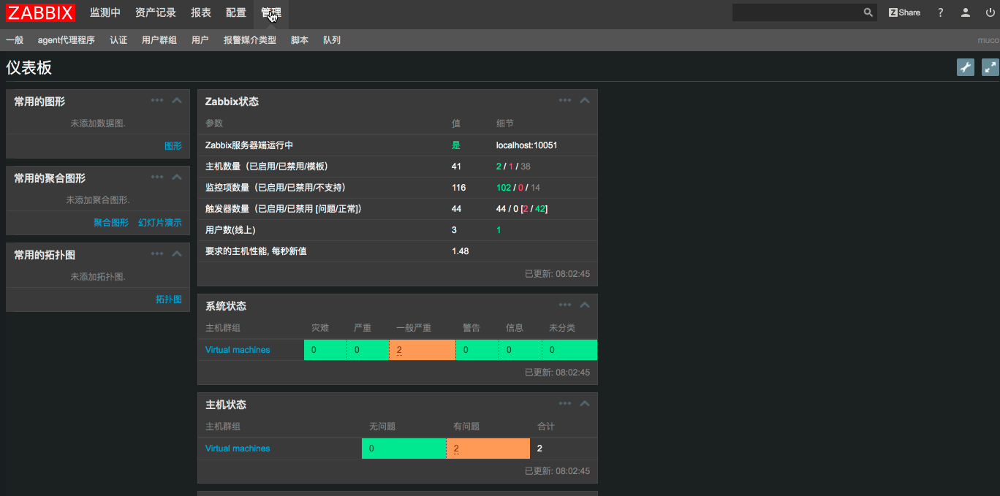

# Zabbix介绍
[基本简介](#introduce)

[亲身体验](#tryit)

[安装步骤](#install)

-- [安装Server](#install-server)

-- [安装Agent](#install-agent)

[常见问题](#problem)

[使用场景](#scenario)

-- [场景1](#scenario1)

-- [场景2](#scenario2)

---

## <a name="introduce"></a>基本简介 [15min]
[Zabbix](http://www.zabbix.com/)是一个开源的企业级系统监控解决方案，系统结构见图1.

- Zabbix Server：接收Agent上报的数据，写入数据库（- MySQL、Oracle等），支持linux，不支持windows；和Agent双向通信，支持向agent发送指令的方式
- Web Server: Zabbix Server端前端页面,用以展示监测数据和配置zabbix，用PHP实现，一般部署在Apache上，与OS平台无关
- Zabbix Agent：被监控主机需要安装agent程序来采集数据，网络设备通过SNMP方式采集数据

### 支持的监控项：
1. CPU, memory, network, disk space and processes
1. 无代理的应用服务
1. 网络设备
1. 虚拟机
1. 自定义服务
1. JAVA容器
1. Web Services
1. IPMI硬件监控


## <a name="tryit"></a>亲身体验 [20min]
[内网演示地址](http://192.168.31.244:8070/zabbix)

[在线演示](https://www.zabbix.org/zabbix/index.php)

[功能截图](http://www.zabbix.com/screenshots)

## <a name="install"></a>安装步骤 [10min]
### <a name="install-server"></a>[Server](https://www.zabbix.com/documentation/3.2/manual/installation/install_from_packages/server_installation_with_mysql)
1. #### 配置源
    Zabbix在CentOS基本源里不可获得，因此必须配置EPEL 和Zabbix 官方repository

    * 安装EPEL repository
    ```
    yum install epel-release
    ```

    * 配置ZabbixZone package repository and GPG key
    ```
    rpm --import http://repo.zabbix.com/RPM-GPG-KEY-ZABBIX

    rpm -Uv http://repo.zabbix.com/zabbix/3.2/rhel/7/x86_64/zabbix-release-3.2-1.el7.noarch.rpms
    ```

1. #### 安装Zabbix server
    ```
    yum install zabbix-server-mysql zabbix-web-mysql zabbix-java-gateway
    ```

1. #### 修改zabbix-server配置
    配置文件在/etc/zabbix/zabbix_server.conf，
    修改以下参数：
    ```
    DBName=zabbix
    DBUser=root
    DBPassword=egova
    DBHost= <zabbx-db-server-host>
    ```   
    或者通过下面命令修改配置
    ```
    sed -i '/# DBName=/a\DBName=zabbix' /etc/zabbix/zabbix_server.conf
    sed -i '/# DBUser=/a\DBUser=root' /etc/zabbix/zabbix_server.conf
    sed -i '/# DBPassword=/a\DBPassword=egova' /etc/zabbix/zabbix_server.conf
    sed -i '/# DBHost=/a\DBHost=192.168.101.14' /etc/zabbix/zabbix_server.conf
    ```

1. #### 启动Server

    启动zabbix-server、httpd,并设置zabbix-server开机自动启动
    ```
    systemctl start zabbix-server
    systemctl restart httpd
    systemctl enable zabbix-server
    ```

1. #### 更换字体以处理图表中文乱码问题

    下载[字体文件](graphfont.ttf)，并存放在zabbix server的`/usr/share/zabbix/fonts/`目录

### <a name="install-agent"></a>[Agent](https://www.zabbix.com/documentation/3.2/manual/installation/install_from_packages/agent_installation)
#### CentOS安装步骤
1. ##### 安装zabbix-agent
    CentOS7
    ```
    groupadd zabbix
    useradd -g zabbix zabbix
    rpm -ivh http://repo.zabbix.com/zabbix/3.2/rhel/7/x86_64/zabbix-release-3.2-1.el7.noarch.rpm
    yum install -y zabbix-agent
    ```

    CentOS6
    ```
    rpm -ivh http://repo.zabbix.com/zabbix/3.2/rhel/6/x86_64/zabbix-release-3.2-1.el6.noarch.rpm
    yum install -y zabbix-agent
    ```


1. ##### 修改zabbix-agent配置

    vi /etc/zabbix/zabbix_agentd.conf

    Server=<zabbix-server-ip>
    ServerActive=<zabbix-server-ip>
    Hostname=<host-name>

    附修改配置命令，注意替换相应IP：
    ```
    sed -i 's/Server=127.0.0.1/Server=<SERVER-IP>/g' /etc/zabbix/zabbix_agentd.conf
    sed -i 's/ServerActive=127.0.0.1/ServerActive=<SERVER-IP>/g' /etc/zabbix/zabbix_agentd.conf
    sed -i 's/Hostname=Zabbix\sserver/Hostname=<AGENT-IP>/g' /etc/zabbix/zabbix_agentd.conf
    ```

1. ##### 启动zabbix-agent
    CentOS7
    ```
    systemctl start zabbix-agent
    ```
    CentOS6
    ```
    /etc/init.d/zabbix-agent start
    ```

#### Windows安装步骤

1. ##### 下载zabbix-agent安装包
    [下载地址](http://www.zabbix.com/downloads/3.2.0/zabbix_agents_3.2.0.win.zip)
2. ##### 安装zabbix-agent

    解压zabbix_agents_3.2.0.win.zip，将conf/zabbix_agentd.win.conf拷贝到C盘根目录，并重命名为zabbix_agentd.conf,并依次修改如下配置：
    ```
    Server=<zabbix-server-ip>
    ServerActive=<zabbix-server-ip>
    Hostname=<host-name>
    ```
    用管理员身份打开命令行窗口，切换到对应的zabbix_agentd.exe目录（根据操作系统版本自行选择win32或者win64）,通过下面命令启动：
    ```
    zabbix_agentd.exe --install
    zabbix_agentd.exe --start
    ```

## <a name="problem"></a>安装常见问题 [5min]
1. Zabbix Server不支持window，建议使用centos 7.

## <a name="scenario"></a>使用场景介绍
### <a name="scenario1"></a>场景一：主机内存不足时发送短信给xxx用户 [5min]
1. ## 配置短信脚本
    使用root用户登录Server
    ```
    cd /usr/lib/zabbix
    chmod a+w alertscripts
    ```

    编写并拷贝sms.sh到alertscripts目录

    ```
    cd /usr/lib/zabbix/alertscripts
    chmod a+x sms-hz.sh
    ```

1. ## 创建报警媒介
    

### <a name="scenario2"></a>场景二：数据库连接数超过400时，发送短信给xxx用户 [15min]
